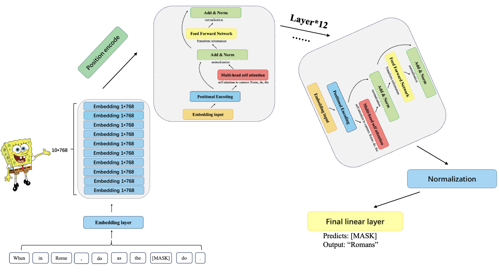

# BERT implemented from scratch

In this file, I implemented BERT from scratch, focusing on the core concepts of transformer architecture, attention mechanisms, and matrix operations. BERT (Bidirectional Encoder Representations from Transformers) is a pivotal model in NLP that uses a bidirectional approach to understand the context of words in a sentence.

 

I will also demonstrate how to load tensors directly from the pre-trained BERT model provided by Hugging Face. Before running this file, you need to download the weights. Here is the official link to download the weights: [Hugging Face BERT](https://huggingface.co/bert-base-uncased)

    

## Model Initialization and Input Processing
### Tokenization
I won’t be implementing a BPE tokenizer here, but Andrej Karpathy has a neat implementation that you might find useful.
 
You can check out his implementation at this link: https://github.com/karpathy/minbpe
# Load Model
import torch
from transformers import BertForMaskedLM, BertTokenizer

model_path="bert-base-uncased"

tokenizer=BertTokenizer.from_pretrained(model_path)

tokenizer.encode("hello world!")

### Loading and Inspecting Model Configuration and Weights

Here, the model configuration and weights are loaded from a pretrained model file. This step ensures that the necessary parameters are ready for the forward pass.

Normally, reading a model file depends on how the model classes are written and the variable names within them. 
However, since we are implementing BERT from scratch, we will read the file one tensor at a time, carefully examining the embedding layers, attention heads, and feed-forward networks that make up BERT’s architecture.
tokenizer.decode(tokenizer.encode("hello world!"))

# 1. 使用 transformers 加载预训练模型

# 加载模型配置和权重
model = BertForMaskedLM.from_pretrained(model_path, torch_dtype=torch.float32)
model
model = model.state_dict()
model.keys()
# float32
model['bert.embeddings.word_embeddings.weight'].shape

import json
with open("/home/jlpanc/anaconda3/envs/codef/STA/bert-base-uncased/config.json", "r") as f:
    config = json.load(f)
config

### Extracting Model Parameters from Config
We use this config to infer details about the model like:

1. The model has 12 transformer layers.
2. Each multi-head attention block has 12 heads.
3. The vocabulary size is 30,522 tokens.
4. The hidden size is 768 dimensions.
5. The intermediate size (for the feed-forward layers) is 3072 dimensions.